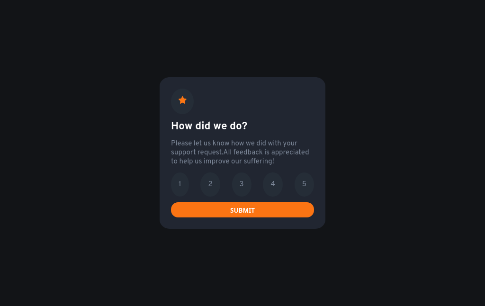
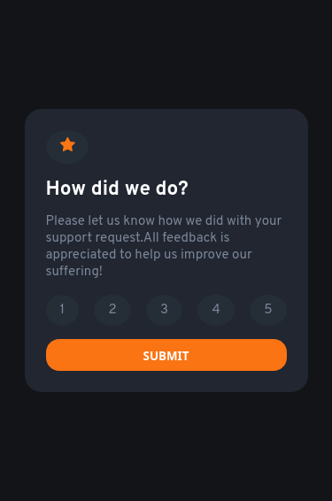

# Frontend Mentor - Interactive rating component solution

This is a solution to the [Interactive rating component challenge on Frontend Mentor](https://www.frontendmentor.io/challenges/interactive-rating-component-koxpeBUmI). Frontend Mentor challenges help you improve your coding skills by building realistic projects.

## Table of contents

- [Overview](#overview)
  - [The challenge](#the-challenge)
  - [Screenshot](#screenshot)
  - [Links](#links)
- [My process](#my-process)
- [Author](#author)

## Overview

### The challenge

Users should be able to:

- View the optimal layout for the app depending on their device's screen size
- See hover states for all interactive elements on the page
- Select and submit a number rating
- See the "Thank you" card state after submitting a rating

### Screenshot

#### Desktop

#### Mobile

### Links

- Solution URL: [Github](https://github.com/ak-chp1/fm_rating_component)
- Live Site URL: [Github Pages](https://ak-chp1.github.io/fm_rating_component)

## My process

- Added the complete HTML markup
- Add CSS
- Added Javascript

### Built with

- Semantic HTML5 markup
- CSS custom properties
- Flexbox

## Author

- Author- Aayush Kumar 
- Frontend Mentor - [@ak-chp1](https://www.frontendmentor.io/profile/ak-chp1)
